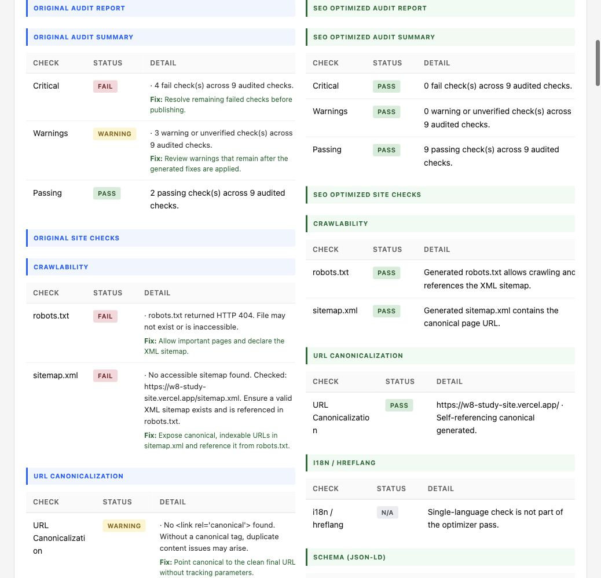

# seo-optimize

**English** · [中文](README.zh.md)

`seo-optimize` is the direct optimization layer for `seo-audit-skill`.
It starts from the same deterministic audit evidence, then generates implementation-ready SEO changes: title, meta description, H1, canonical, OG/Twitter tags, JSON-LD, robots.txt, sitemap.xml, and a content brief.

Use this skill when a user wants a website optimized for SEO, needs exact tags or schema to paste into a page, or wants safe first-pass edits applied to a local HTML file.

## Report Preview

The optimizer always generates an audit report first, then a before-vs-after comparison report. The comparison report uses the original audit template and shows the complete original audit on the left and the SEO-optimized target audit on the right.



## What It Produces

| Output | File / location | Purpose |
|---|---|---|
| Before audit report | `reports/<site>-audit.html` | Required baseline report generated before optimization |
| Optimization kit | `reports/<site>-seo-optimization.md` or JSON | Copy-ready recommendations and snippets |
| Comparison report | `reports/<site>-comparison.html` | Full original audit vs optimized target audit |
| Optional patched HTML | The file passed to `--html-file` | Low-risk local edits for title, meta description, canonical, and first H1 |
| Backup | `<file>.<timestamp>.bak` | Automatic backup before `--apply` writes changes |

By default, HTML reports are served from:

```text
http://127.0.0.1:8766/
```

Example output:

```text
Audit report -> http://127.0.0.1:8766/example-com-audit.html
SEO optimization kit saved -> /path/to/reports/example-com-seo-optimization.md
Comparison report -> http://127.0.0.1:8766/example-com-comparison.html
```

## Quick Start

Run from the repository root:

```bash
python seo-audit/scripts/seo-optimize.py https://example.com \
  --keyword "ai workflow automation" \
  --brand "Acme"
```

Generate JSON for pipelines:

```bash
python seo-audit/scripts/seo-optimize.py https://example.com \
  --keyword "ai workflow automation" \
  --brand "Acme" \
  --format json
```

Apply safe local HTML edits:

```bash
python seo-audit/scripts/seo-optimize.py https://example.com \
  --html-file ./index.html \
  --keyword "ai workflow automation" \
  --brand "Acme" \
  --apply
```

## Recommended Agent Workflow

1. Fetch and analyze the URL or local HTML file.
2. Infer missing keyword, brand, and page type from title, H1, page copy, and hostname.
3. Run site, page, schema, and social checks.
4. Write the required before-audit HTML report.
5. Generate the optimization kit.
6. If `--apply` is enabled, patch only low-risk local HTML fields and save a backup.
7. Write the side-by-side comparison report.
8. Return the local report URLs and the optimization kit path.

## Required Inputs

| Input | Required | Notes |
|---|---:|---|
| URL | Yes, unless `--html-file` is enough for local analysis | Public URL used for canonical, robots.txt, sitemap.xml, and report naming |
| `--keyword` | Recommended | Improves title, meta description, H1, heading brief, and keyword placement guidance |
| `--brand` | Recommended | Used in titles, schema, social tags, and H1 |
| `--audience` | Optional | Makes meta description and content brief more specific |
| `--business-goal` | Optional | Helps avoid vague descriptions and generic calls to action |
| `--page-type` | Optional | `auto`, `homepage`, `article`, `product`, `faq`, `howto`, or `generic` |
| `--html-file` | Optional | Enables local static analysis and optional local patching |

If keyword or brand is omitted, the script infers them. The final response should say when values were inferred.

## CLI Options

| Option | Default | Description |
|---|---|---|
| `url` | None | Public page URL |
| `--html-file` | None | Local HTML file to analyze or patch |
| `--keyword`, `-k` | Inferred | Primary keyword |
| `--brand` | Inferred | Brand or site name |
| `--audience` | Empty | Target audience |
| `--business-goal` | Empty | Concrete value proposition or conversion goal |
| `--page-type` | `auto` | Page type for schema and title logic |
| `--timeout` | `20` | HTTP timeout in seconds |
| `--output`, `-o` | `reports/<site>-seo-optimization.md` | Optimization kit output path |
| `--format` | `markdown` | `markdown` or `json` |
| `--reports-dir` | `reports` | HTML report output directory |
| `--report-port` | `8766` | Local report server port |
| `--no-report-server` | Off | Write reports without starting the local server |
| `--apply` | Off | Patch local HTML fields; requires `--html-file` |
| `--encoding` | `utf-8` | Encoding for local HTML files |

## Optimization Kit Contents

The Markdown kit includes:

- ranked priority fixes mapped from audit findings
- optimized `<title>`
- optimized `<meta name="description">`
- canonical tag
- OG and Twitter Card tags
- recommended H1
- JSON-LD schema snippet
- robots.txt snippet
- sitemap.xml snippet
- content brief with H2 sections, keyword placement guidance, and internal link targets

## Comparison Report

The comparison report is built from the same audit-report template as `seo-audit`.
It includes:

- top-level summary of original vs optimized audit counts
- full original audit report in the left column
- full SEO-optimized target audit in the right column
- on-page field comparison table
- optimized head tag snippet
- JSON-LD snippet
- original and optimized priority actions
- original and optimized insight walkthroughs

The optimized side is a target-state report generated from the recommendations. It does not claim a live website changed unless `--apply` was used on a local file.

## `--apply` Safety Boundary

`--apply` only edits a local file passed through `--html-file`.

It can update:

- `<title>`
- `<meta name="description">`
- `<link rel="canonical">`
- the first `<h1>`

It does not edit framework components, route metadata APIs, CMS data, image alt attributes, body copy, robots.txt, sitemap.xml, or production deployments. Use the generated kit for those changes.

## How Recommendations Are Generated

The optimizer combines:

- static page facts from the HTML parser
- deterministic audit JSON from `check-page.py`, `check-site.py`, `check-schema.py`, and `check-social.py`
- keyword, brand, audience, business goal, and inferred page type
- conservative title/meta length fitting
- page-type schema templates
- content brief heuristics for headings, keyword placement, and internal links

It avoids inventing factual claims about customers, pricing, certifications, awards, metrics, or integrations.

## Examples

Homepage:

```bash
python seo-audit/scripts/seo-optimize.py https://example.com \
  -k "ai workflow automation" \
  --brand "Acme" \
  --audience "operations teams" \
  --business-goal "automate recurring workflows"
```

Article:

```bash
python seo-audit/scripts/seo-optimize.py https://example.com/blog/seo-checklist \
  -k "seo checklist" \
  --brand "Acme" \
  --page-type article
```

Local HTML patch:

```bash
python seo-audit/scripts/seo-optimize.py https://example.com \
  --html-file ./public/index.html \
  -k "ai workflow automation" \
  --brand "Acme" \
  --apply
```

## Testing

Run:

```bash
python3 -m unittest tests.test_seo_optimize -v
```

The tests cover:

- static fact extraction
- actionable tag generation
- safe local HTML patching
- required audit and comparison report rendering
- side-by-side comparison report structure

## Notes for Maintainers

- Generated reports live in `reports/` and are ignored by Git.
- The report server is local-only and binds to `127.0.0.1`.
- The optimizer depends on `requests`, matching the existing audit scripts.
- The comparison report injects only comparison-specific CSS into the existing audit template.
